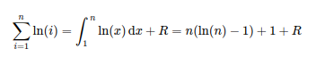

# SerreaioTyls

## Условие

Мне в руки попал скрипт, которым был зашифрован флаг, и результат работы. Расшифровать, как по мне, очень просто, нужно только поменять одну строчку кода. Вот только идет уже третий месяц вычислений, а флага так и нет. Может, у тебя быстрее будет?

Формат флага: `TulaCTF{some_flag}`

## Решение

Файл `out.py` предлагает посчитать гамму для расшифровки флага, используя непонятные функции. Анализ этих функций показывает, что все они используются для вычисления натурального логарифма. Таким образом, гамма является суммой натуральных логарифмов от `1` до `avocado`. Посчитать что-то такое большое итеративным методом не представляется возможным, поэтому воспользуемся интегрированием.

Полное решение смотри в `shortcut.py`.
