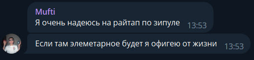

# Zipulya

## Условие

Пентестим мы, значит, одну контору, не нашли абсолютно ничего, кроме SMB-шары с вот этим файлом. Прикол в том, что у них парольная политика 12+ символов, специальные символы и символы верхнего и нижнего регистра. Хм.. интересно, что там внутри?

Формат флага: `TulaCTF{some_flag}`

## Решение

Пароль от архива - название архива.

